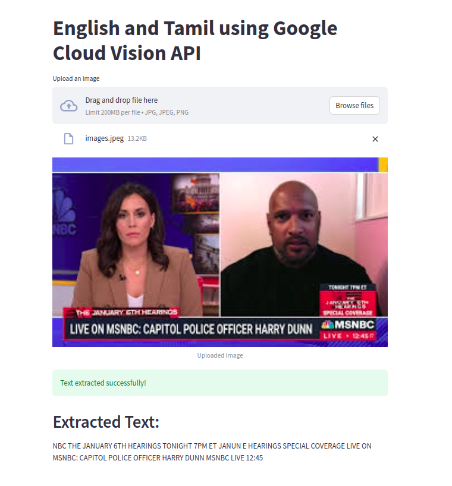

# Text Extraction from Images using Google Cloud Vision API
This project is a Streamlit web application designed to extract text from images using Google Cloud Vision API. It supports image uploads and displays both the original image and the extracted text. This application can extract text from images in English and Tamil, showcasing the powerful OCR capabilities of the Google Cloud Vision API.

# Features
Image Upload: Users can upload images in JPEG or PNG format.
Text Extraction: Extracts text from uploaded images using Google Cloud Vision API.
Display Results: Shows the uploaded image and the extracted text on the web application.
Installation
To run this application, you need Python installed on your system. Follow these steps to set it up:

# Clone the repository:
```python
git clone <repository-url>
cd <repository-directory>
```

# Install dependencies:
```python
pip install -r requirements.txt
```
# Set up Google Cloud Vision API:
Create a project in the Google Cloud Platform.
Enable the Vision API for your project.
Create a service account and download the service account key file.
Rename your service account key file to txxxx.json and place it in the root directory of this project or set the GOOGLE_APPLICATION_CREDENTIALS environment variable to the path of your key file.

# Run the application:
```python
streamlit run app.py
```

# Usage
Navigate to the Streamlit web interface.
Use the "Upload an image" button to upload a JPEG or PNG image.
The application will display the uploaded image and the extracted text.


FastAPI Code also provided for hosting


License
This project is licensed under the MIT License. Feel free to use it as you see fit.
